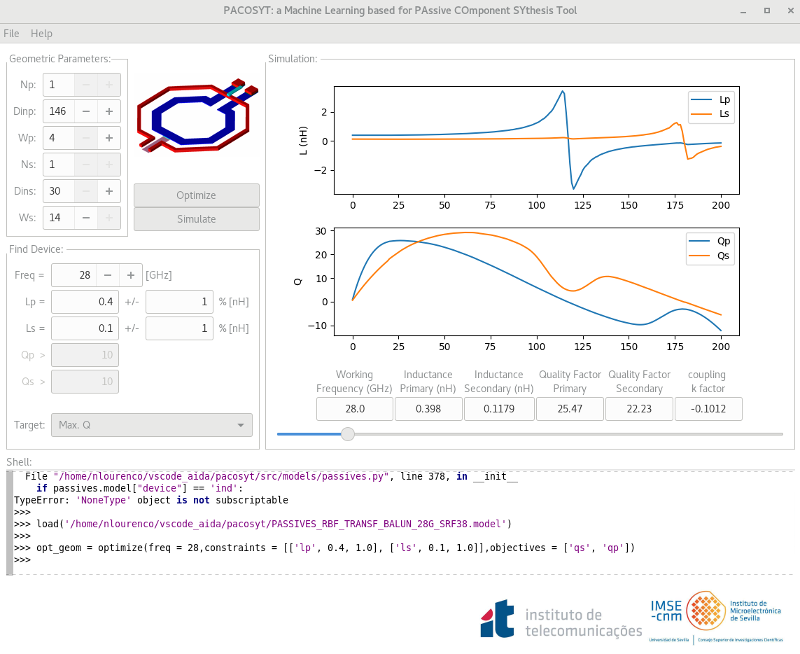

# PACOSYT: an ML based PAssive COmponent SYnthesis Tool



## [Requirements](requirements.txt) 
pyhton 3.8


ipykernel==6.9.1 
pandas==1.4.1
scikit-learn==1.0.2
scipy==1.8.0
numpy==1.22.2
wxPython==4.1.1
matplotlib==3.5.1


*Only needed to run TMTT test code* 

tensorflow==2.8.0

## Download and Installation

Clone the repository or download the source code.

Create a virtual environment, activate it and install the dependencies. For a faster wxPyhton installation you can check their [wheels](https://wxpython.org/pages/downloads/index.html)

```bash
$ python3.8 -m venv <path to your venv>
$ . <path to your venv>/bin/activate
<your venv>$ python -m pip install --upgrade pip
<your venv>$ pip install -r requirements.txt
```

Tensorflow is needed to RUN ANNmodels, but it is not required to run the tool.

## Data Description
The data available at the moment are:
- spiral octogonal transformer in a 65nm - 1:1, 2:1, 1:2 and 1:1 with primary overlapping secondary (_balun).
- spiral octogonal inductor  in 350nm - 1, 2, 3, 4, 5 turns


## Quick Start

Before creating the models, the data must be preprocessed. This is done using the [data_prepare_tmtt_transf.ipynb](notebook/data_prepare_tmtt_transf.ipynb) and [data_prepare_tmtt_indRG.ipynb](notebook/data_prepare_tmtt_indGR.ipynb) notebooks.

Once the data is reorganized, the models cab be created as indicated in the [notebook](notebooks/models_transf_balun_srf38.ipynb). Notebooks model_tmtt* make comparisson between modelings apreaoches and strategies.

Once the model is done execute PACOSYT.
```bash
<your venv>$ python src/pacosyt.py
```

## TODOs
- Include data-prepare + model generation in GUI
- Formalize testing and CI 
- Pypi packaging

## Acknowledgements
This research is funded by the European Union’s Horizon 2020 research and innovation program under the MSCA grant agreement No. 892431 and also by the Instituto de Telecomunicações internal research projects LAY(RF)2 (X-0002-LX-20) and HAICAS (X-0009-LX-20). This work was supported by grant PID2019-103869RB-C31 funded by MCIN/AEI/10.13039/ 501100011033.

###### Copyright (C) 2022 Instituto de Telecomunicações & IMSE-CSIC
###### This program comes with ABSOLUTELY NO WARRANTY
